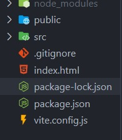
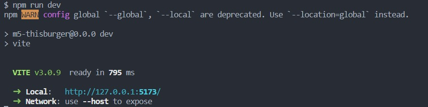

# This.Burger

Projeto de conclusão do último módulo do curso de Web Dev. FullStack da Resilia. 
A proposta é criar um site que vai executar todas as ações do CRUD (Create, Read, Update, Delete) utilizando o padrão REST dos verbos HTTP. 
A aplicação foi desenvolvida em React juntamente com a API (https://github.com/Joao-P-G-Begiato/This.Burger) desenvolvida anteriormente pelos mesmos colaboradores.

## 🚀 Começando

Essas instruções permitirão que você obtenha uma cópia do projeto em operação na sua máquina local.

Clone este repositório:
```
git clone https://github.com/rafaelljordao/m5-thisburger.git
```

### 📋 Pré-requisitos

O que você precisa para instalar o software e como instalá-lo?

```
Node.js Versão 16.15.1 (Que no momento é a versão LTS)
```

### 🔧 Instalação

Uma série de exemplos passo-a-passo que informam o que você deve executar para ter um ambiente de desenvolvimento em execução.

**Instalação do Node e Express:**


***Windows:***


Você pode baixar direto pelo site: [node](https://nodejs.org/en/)

Ou então via Chocolatey:
```
choco install nodejs-lts
```

***Mac:***

Você pode baixar direto pelo site: [node](https://nodejs.org/en/)

***Linux*** 

via apt e snap:

```
sudo apt-get install curl

curl -fsSL https://deb.nodesource.com/setup_lts.x | sudo -E bash -

sudo apt-get install -y nodejs
```

Após a instalação do Node utilizaremos os comandos do NPM (Node Package Manager) no terminal.

```
npm install
```
Após a instalação você ele deve ter baixado uma pasta chamada node_modules e um arquivo chamado package.json onde você poderá ver as dependências do projeto já instaladas, conforme abaixo:  

  


## Rodando a aplicação:

Para rodas a aplicação basta utilizar o seguinte comando no terminal:
```
npm run dev 
```

Em seguida, clique no link que aparecerá em seu terminal para ser redirecionado até sua página na web. Como ilustrado a seguir:  

  


---

## 🛠️ Construído com as seguintes ferramentas:

* [Vite](https://vitejs.dev/guide/)
* [React](https://pt-br.reactjs.org/docs/getting-started.html)
* [Node](https://nodejs.org/en/docs/)
* [Axios](https://axios-http.com/ptbr/docs/intro)


---

## ✒️ Autores

Projeto desenvolvido em conjunto pelo Squad 1:

* **Fernando Patrick**  - [FernandoPatrick](https://github.com/FernandoPatrick)
* **Flávio Christovam** -  [fchristovam](https://github.com/fchristovam)
* **João Paulo** - [Joao-P-G-Begiato](https://github.com/Joao-P-G-Begiato)
* **Lucas Passos** - [LucasBinho](https://github.com/LucasBinho)
* **Rafael Jordão** - [rafaelljordao](https://github.com/rafaelljordao)

---

## 📄 Licença

Este projeto está sob a licença MIT - veja o arquivo [LICENSE](https://github.com/Joao-P-G-Begiato/deburger/blob/main/LICENSE) para detalhes.

---

## 🎁 Expressões de gratidão

* Aos colegas desenvolvedores que participaram desse projeto (listados acima).
* Aos facilitadores Tech Jarom Aidukaitis, Leonardo Costa e Jonas Emanuel que nos acolheram nesse universo.
* A facilitadora Anna Caroline Souza que nos deu força nos momentos mais tortuosos dessa jornada.

---

